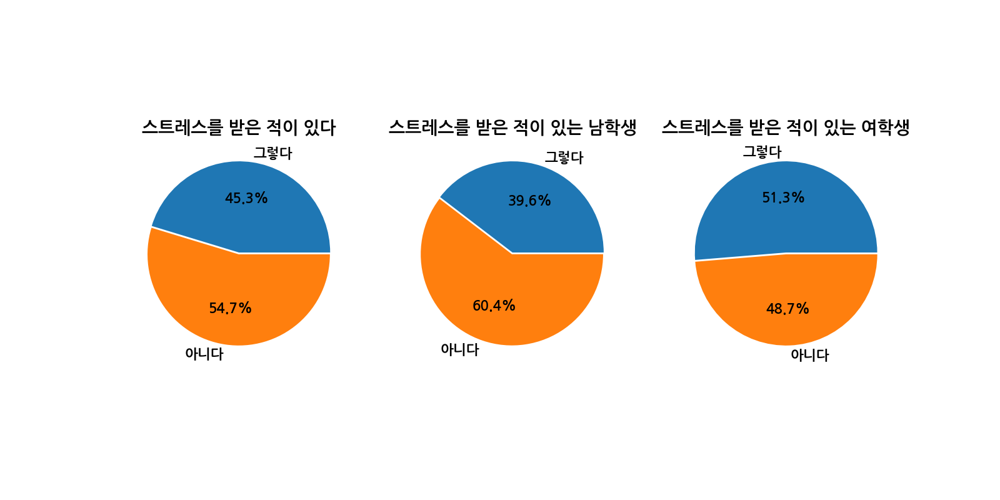
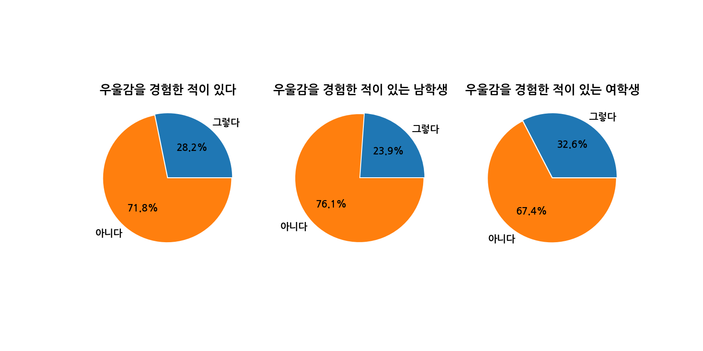
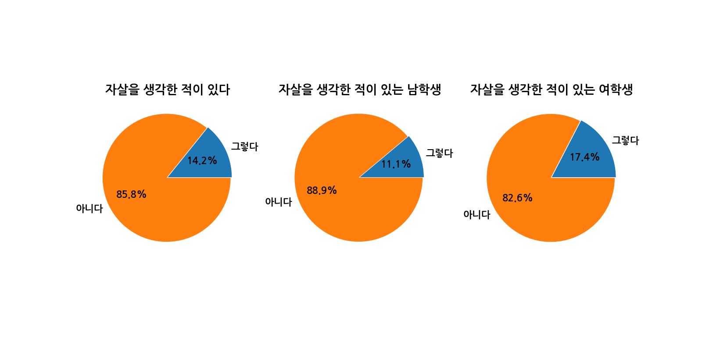

# 청소년 정신 건강 데이터 분석

[](https://www.python.org/)

이 프로젝트는 **청소년들의 스트레스, 우울감, 자살 생각 경험률** 데이터를 기반으로 탐색적 데이터 분석(EDA)을 수행한 것입니다. 성별에 따른 정신 건강 상태 분포를 시각화하여 인사이트를 도출합니다.

---

## 📁 데이터 출처

- [청소년 정신 건강 통계 데이터](https://data.seoul.go.kr/dataList/10956/S/2/datasetView.do)

---

## 🔧 사용 기술

| 분류 | 기술 스택 |
|------|-----------|
| 운영 체제 / IDE |   |
| 언어 / 라이브러리 |    |
| 버전 관리 |   |

---

## 📊 분석 항목

- 스트레스, 우울감, 자살 생각 비율 분석
- 성별에 따른 정신 건강 상태 시각화
- Pie Chart로 시각적 비교 제공

---

## 🖼️ 결과 예시

<div align="center">
  <br/>
  <em>스트레스 경험률</em><br/><br/>
  <br/>
  <em>우울감 경험률</em><br/><br/>
  <br/>
  <em>자살 생각률</em>
</div>

---

## 🔍 주요 인사이트

- 여학생의 정신 건강 지표가 전반적으로 높게 나타남
- 자살 생각률 또한 여학생에서 두드러짐
- 성별 맞춤형 정신 건강 관리의 필요성 제시

---

## 🛠️ 코드 구성

- `TeenageMental`: 데이터 불러오기 및 전처리
- `TeenageMentalVisualizer`: 시각화(Pie Chart) 및 이미지 저장

---

## 🚀 실행 방법

1. `data/teenage_mental.xlsx` 파일 준비
2. 필요한 라이브러리 설치:
   ```bash
   pip install pandas matplotlib openpyxl
